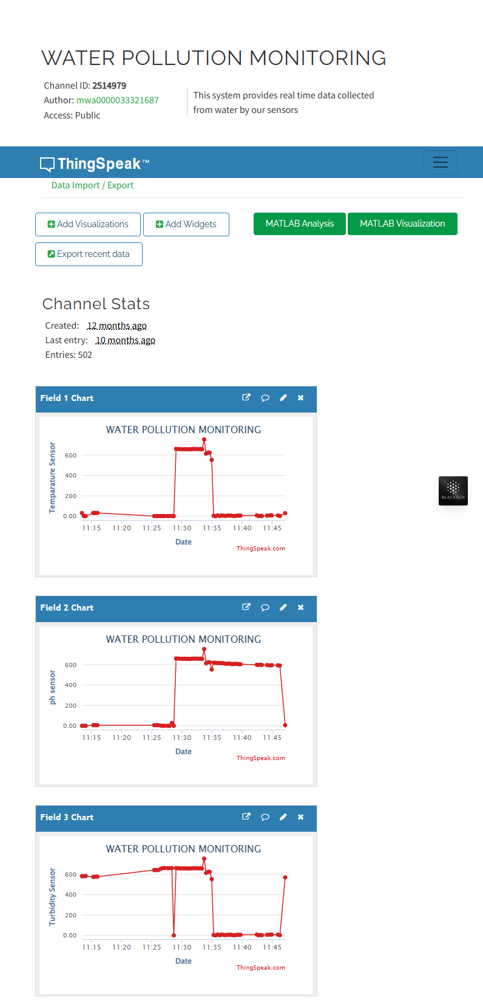

---

# 💧 IoT Water Quality Monitoring System  
> **Smart Monitoring of pH, Temperature & Turbidity – Anytime, Anywhere!** 🌍📶

## 🧠 What’s This About?

An **IoT-powered water quality tracker** that monitors essential water parameters — temperature, pH, and turbidity — in real-time and sends the data to the cloud via Wi-Fi. Built using **Arduino Uno** and **ESP8266**, and visualized beautifully on **ThingSpeak** 📊⚙️

---

## ⚙️ How It Works

🛠️ **Data Flow Breakdown:**

1. **📥 Sensor Data Acquisition**  
   - `DS18B20` for temperature 🌡️  
   - `Analog pH Sensor` for acidity/alkalinity 🧪  
   - `Turbidity Sensor` for water clarity 💧  

2. **🔁 Serial Communication (Arduino ➜ ESP8266)**  
   - Values are formatted as `temp,pH,turbidity\n`

3. **🌐 ESP8266 Wi-Fi Module**  
   - Connects to a Wi-Fi network  
   - Parses data from Arduino  
   - Sends readings to **ThingSpeak** using HTTP requests

4. **📈 ThingSpeak Cloud**  
   - Real-time data logging  
   - Custom chart visualizations for each sensor

---

## 🧩 Hardware Used

Component | Function
Arduino Uno | Reads and formats sensor data
ESP8266 (ESP-01) | Wi-Fi and HTTP communication
DS18B20 | Temperature measurement
pH Sensor | Analog pH measurement
Turbidity Sensor | Analog water clarity measurement
Jumper Wires | Hardware connections

---

## 💾 Software Stack

- **Arduino Code**  
  Reads data from sensors and sends it via serial
  - Libraries: `OneWire`, `DallasTemperature`

- **ESP8266 Code**  
  Parses serial input, connects to Wi-Fi, uploads data
  - Libraries: `ESP8266WiFi`, `WiFiClient`

- **ThingSpeak**  
  Free cloud platform for storing and graphing sensor data in real-time

---

## 🚀 Live Demo & Visuals

> 📉 Track how your water quality changes in real-time — perfect for labs, home experiments, and smart environmental projects.

---

## 🛠️ How to Set It Up

### 🔌 Hardware

1. Connect all sensors to Arduino (A0 for Turbidity, A1 for pH, D2 for DS18B20)  
2. Link Arduino TX to ESP8266 RX (and vice versa)  
   - ⚠️ Use a logic level shifter or voltage divider (ESP8266 is 3.3V tolerant!)

### 💡 Arduino IDE

- Install the required libraries  
- Upload your `arduino_code.cpp` to the Arduino Uno

### 🌐 ESP8266 Setup

- Configure Wi-Fi SSID & password in `esp8266_code.cpp`  
- Replace ThingSpeak API key with your own  
- Upload using Arduino IDE (after selecting the correct board)

### 📡 ThingSpeak Configuration

1. Sign up at [ThingSpeak.com](https://thingspeak.com)  
2. Create a new channel  
3. Add fields: `Temperature`, `pH`, `Turbidity`  
4. Copy your **Write API Key** into your ESP8266 code

---

## ⚠️ Calibration & Tips

- **pH Sensor:** Needs proper calibration with buffer solutions for accuracy  
- **Turbidity Sensor:** Map raw analog values to NTU using calibration curve  
- **Power Supply:** Use a stable 3.3V source for ESP8266  
- **Serial Baud Rate:** Ensure both devices use `9600`  

---

## 💡 Ideas for Future Improvements

- 📈 Integrate with **Google Sheets** or **Firebase**  
- 📊 Switch to **MQTT** for scalable deployment  
- 📱 Add a mobile app for alerts & stats  
- 🧠 Apply ML to predict contamination patterns

---

## 👨‍💻 Project By: [Nabhan](https://github.com/imnabhan)  
_“From code to cloud – bringing water quality monitoring into the smart era.”_ 💧✨

---

